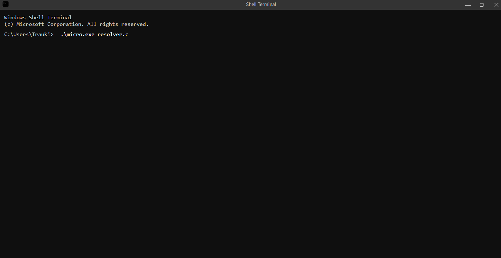
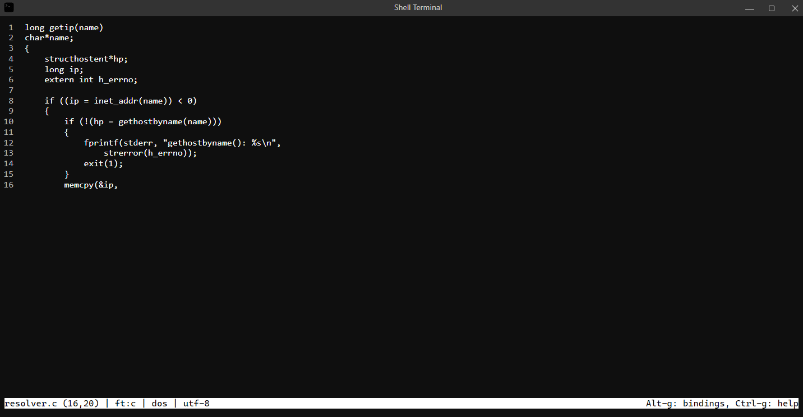

# Hacker Terminal (Windows)

Displays "hacker-style" text as random keys are pressed. Designed for aesthetic or cinematic use.

## Guide

Clone the repository: `git clone https://github.com/Trauki/hacker-terminal-win`

Get dependencies: `dotnet restore`

Run the code: `dotnet run`

Generate executable: `dotnet publish -r win-x64 -c Release`

The executable is roughly 90 MB and can be found at: `\bin\Release\net9.0\win-x64\publish\HackerTerminal.exe`

## Features

- **Blinking Caret** - The caret, `|`, blinks to mimic authentic terminal functionality.
- **Windows Styling** - The GUI is styled to slightly match real Windows system visuals.
- **Hacker Type** - Pressing keys reveals predefined pseudo-code in a simulated typing flow.
- **Text Editor Simulation** – Includes a staged editing session triggered by typing a fake command, which enters into a file view similar in appearance to the [Micro](https://micro-editor.github.io/) text editor.
- **Custom Titlebar and ScrollBar** - Doesn't use [FluentTheme](https://docs.avaloniaui.net/docs/basics/user-interface/styling/themes/fluent) or [SimpleTheme](https://docs.avaloniaui.net/docs/basics/user-interface/styling/themes/simple).

## Preview

